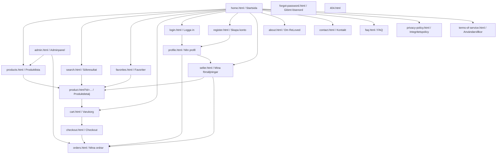

# ReLoved — Sitemap

## Textformat

```
home.html
├── products.html
│   └── product.html?id=...
├── search.html
│   └── product.html?id=...
├── favorites.html
│   └── product.html?id=...
├── cart.html
│   └── checkout.html
│       └── orders.html
├── login.html
│   └── profile.html
│       ├── orders.html
│       └── seller.html
│           ├── product.html?id=...
│           └── orders.html
├── register.html
│   └── profile.html
├── about.html
├── contact.html
├── faq.html
├── privacy-policy.html
├── terms-of-service.html
└── 404.html  (visas vid ogiltig/saknad URL, ej länkad från menyn)

admin.html  (separat, kräver admin-roll)
├── products.html   (lägg till / redigera / granska annonser)
└── orders.html     (lista + uppdatera status)
```

## Diagramformat

