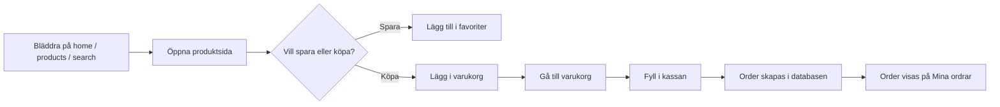
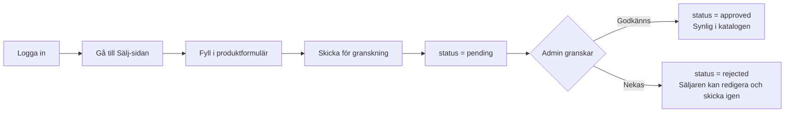
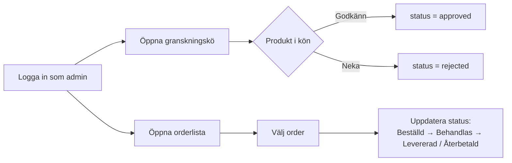

# ReLoved — Användarflöden

Tre huvudflöden i systemet: kund som handlar, kund som säljer, och admin som modererar.

## 1. Kund — handla en produkt

## 2. Kund — sälj en produkt (annonsflöde)

## 3. Admin — moderera och hantera ordrar

## Sammanfattning av statusflöden

| Entitet | Statusfält | Möjliga värden | Vem ändrar |
|---|---|---|---|
| `products.status` | Annonsstatus | `pending` → `approved` / `rejected` (senare `sold`, `archived`) | Admin (godkänner/nekar), system (sold) |
| `orders.status` | Orderstatus | `ordered` → `processing` → `shipped` → `delivered` (eller `refunded`/`cancelled`) | Admin |