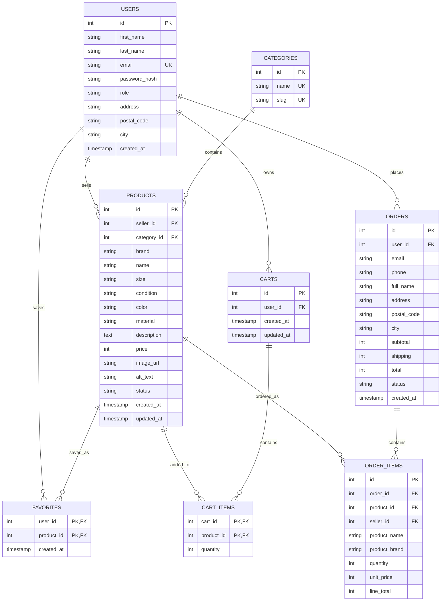

# ReLoved — Databasdiagram

Motsvarar `database/schema.sql`. GitHub renderar diagrammet nedan automatiskt när filen visas på github.com. Se även `ER-diagram.png` för en exporterad bild av samma diagram.

